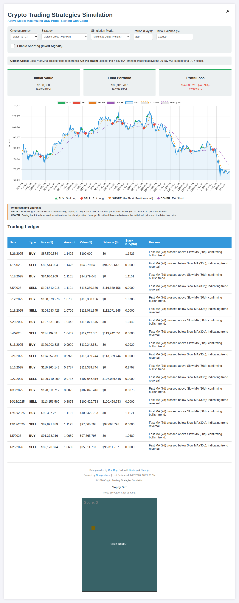

# Crypto Trading Strategies Simulation

A professional-grade, portable cryptocurrency trading simulator with real-world data integration, multiple technical strategies, and portfolio optimization modes.



## 🚀 Features

### 📊 Trading Simulation
- **Multi-Crypto Support**: Fetches live data for Top 10 cryptocurrencies (Bitcoin, Ethereum, Solana, etc.) from the [CoinGecko API](https://www.coingecko.com/).
- **Smart Caching**: Implements a 12-hour local storage cache to minimize API hits and ensure smooth performance.
- **Advanced Strategies**:
    - **Trend Following**: Golden Cross (7/30 MA), EMA Cross (12/26), SMA Cross (50/200), Parabolic SAR.
    - **Momentum**: RSI, MACD Momentum, Stochastic Oscillator, Williams %R.
    - **Mean Reversion**: Bollinger Bands, MA 20 Reversion, Commodity Channel Index (CCI).
    - **Volatility**: Donchian Channels.
    - **Short Strategies**: Inverse RSI, MACD Bearish, Short Bollinger, and Short Mean Reversion.
- **Short Selling & Covering**: Full support for short positions to profit from downward price movements.
- **Simulation Modes**:
    - **Maximize Dollar Profit**: Optimize for ending with the highest USD value.
    - **Stack Assets (Accumulation)**: Optimize for accumulating the maximum amount of the selected cryptocurrency.

### 📈 Visualization
- **Interactive Graphing**: Full-width interactive chart powered by [Chart.js](https://www.chartjs.org/).
- **Technical Indicators**: Visual overlays for Moving Averages, RSI, MACD, and Bollinger Bands.
- **Trade Markers**: Clear visual markers for Long Entry (BUY), Long Exit (SELL), Short Entry (SHORT), and Short Exit (COVER).
- **Dark Mode**: Contrast-optimized UI for all light conditions.

### 📜 Trading Ledger
- **Detailed Logs**: Every trade is logged with date, price, amount, value, **Rolling Balance**, **Rolling Crypto Stack**, and a **Reason** explaining the strategy signal.

## 🛠️ Setup & Usage

### Web Version (Recommended)
Simply open `index.html` in any modern web browser. No server required!

### CLI Version
1. **Install Dependencies**:
   ```bash
   npm install
   ```

2. **Run Simulation**:
   ```bash
   npm start
   ```

## 🧪 Testing
Run the comprehensive test suite with:
```bash
npm test
```

## 📚 Credits & Libraries
- **Data Source**: [CoinGecko](https://www.coingecko.com/) (Market prices & symbols)
- **Calculation Engine**: [Danfo.js](https://js.danfo.js.org/) (Data manipulation)
- **Visualization**: [Chart.js](https://www.chartjs.org/) (Interactive charts)
- **Developer**: [Google Jules](https://jules.google/)

---
*Disclaimer: This is a simulator for educational and entertainment purposes only. Past performance does not guarantee future results.*
